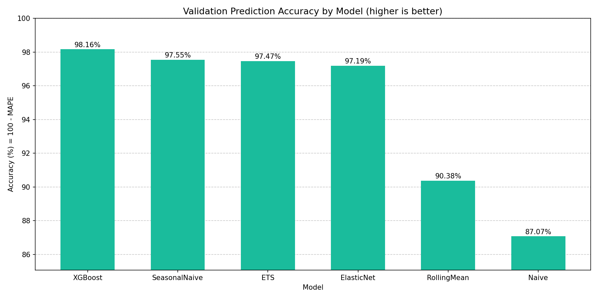

# Eskom Energy Demand Forecasting

<a target="_blank" href="https://cookiecutter-data-science.drivendata.org/">
    
</a>

This project aims to accurately predict the South Africa's hourly energy demand using:

- **Eskom historical electricity demand data**

The goal is to **predict short-term electricity demand (hourly)** to support:
- Energy production planning
- Grid stability analysis
- Renewable energy integration
- Scenario and sensitivity analysis

This repository demonstrates an **end-to-end data science workflow**, from raw data ingestion to model evaluation, structured to professional standards.

---

## Business Motivation (Why This Project Matters)

Electricity demand forecasting is **critical** in South Africa due to:
- Load shedding risk
- Increasing renewable energy penetration
- Operational and financial planning requirements

Accurate hourly forecasts allow:
- Better dispatch planning
- Reduced operating costs
- Improved grid reliability
- Data-driven decision-making for utilities and energy traders

---

## Data Sources

### 1. Eskom Electricity Demand Data
- Source: **(https://www.eskom.co.za/dataportal/)**
- Description:
  - Historical national electricity demand
  - Hourly or sub-hourly resolution (depending on release)
  - Aggregated at grid level

> Eskom is South Africa’s primary electricity utility and the authoritative source for national demand data.

## How to Run

### 1) Install dependencies
```bash
make requirements
```

### 2) Prepare data files
Place the Eskom raw CSV in:
`data/raw/ESK17472.csv`

### 3) Configure splits
Update `configs/config.yaml` before training:
- `train_end`, `val_end`, `test_end`
- `timezone`, `freq`, and `timestamp_format` if your data changes

Example:
```yaml
train_end: "2024-09-30 03:00:00+02:00"
val_end: "2025-07-01 00:00:00+02:00"
test_end: "2026-03-31 23:00:00+02:00"
```

### 4) Build processed dataset
```bash
make data
```

### 5) Train models (test evaluation disabled by default)
```bash
make train
```

### 6) Generate predictions
```bash
make predict
```

Notes:
- Test evaluation is gated by `run_test_eval` in `configs/config.yaml` and is **disabled** by default.

---
## XGBoost Model

The training pipeline uses XGBoost as the primary tree-based model. It trains on lag and rolling-window
features derived from the target series plus calendar features (hour, day-of-week, month, cyclic encodings)
and performs recursive forecasting across each validation horizon.

Requires `xgboost` from `requirements.txt`.

Default hyperparameters:
- `n_estimators=300`, `learning_rate=0.05`, `max_depth=6`
- `subsample=0.9`, `colsample_bytree=0.9`

If XGBoost is not installed the pipeline falls back to LightGBM (if enabled) and then
`HistGradientBoostingRegressor` from scikit-learn.

Environment variables (optional):
- `ENABLE_XGBOOST` (true/false)
- `ENABLE_LIGHTGBM` (true/false)
- `ENABLE_TREE_MODEL` (true/false)

### Backtest Results (6-fold rolling-origin, 24-hour horizon)

| Model | Mean MAE | Accuracy (100 − MAPE) | vs SeasonalNaive |
|---|---|---|---|
| XGBoost | ~481 | 98.16% | −25% |
| SeasonalNaive | ~644 | 97.55% | baseline |
| ETS | ~651 | 97.47% | +1% |
| ElasticNet | ~729 | 97.19% | +13% |



XGBoost is selected as the final model and saved to `models/final_model.pkl`.

---
## Project Organization

This repository follows a **cookiecutter-style data science layout** to mirror real-world production projects:

```
├── LICENSE            <- MIT Open-source license
├── Makefile           <- Makefile with convenience commands like `make data` or `make train`
├── README.md          <- The top-level README for developers using this project.
├── data
│   ├── external       <- Data from Eskom Data Portal.
│   ├── interim        <- Intermediate data that has been transformed.
│   ├── processed      <- The final, canonical data sets for modeling.
│   └── raw            <- The original, immutable data dump.
│
├── docs               <- A default mkdocs project; see www.mkdocs.org for details
│
├── models             <- Trained and serialized models, model predictions, or model summaries
│
├── notebooks          <- Jupyter notebooks. Naming convention is a number (for ordering),
│                         the creator's initials, and a short `-` delimited description, e.g.
│                         `1.0-rm-initial-data-exploration`.
│
├── pyproject.toml     <- Project configuration file with package metadata for 
│                         eskom_energy_demand_forecasting and configuration for tools like black
│
├── references         <- Data dictionaries, manuals, and all other explanatory materials.
│
├── reports            <- Generated analysis as HTML, PDF, LaTeX, etc.
│   └── figures        <- Generated graphics and figures to be used in reporting
│
├── requirements.txt   <- The requirements file for reproducing the analysis environment, e.g.
│                         generated with `pip freeze > requirements.txt`
│
├── configs            <- YAML/TOML configuration files
│   └── config.yaml    <- Project configuration values
│
├── scripts            <- Utility scripts and automation helpers
│
├── src
│   └── eskom_energy_demand_forecasting   <- Source code for use in this project.
│       │
│       ├── __init__.py             <- Makes eskom_energy_demand_forecasting a Python module
│       ├── config.py               <- Load and validate YAML configuration
│       ├── dataset.py              <- Scripts to download or generate data
│       ├── features.py             <- Code to create features for modeling
│       ├── data/                   <- Data-loading package namespace
│       ├── models/                 <- Model package namespace
│       ├── modeling                
│       │   ├── __init__.py 
│       │   ├── predict.py          <- Code to run model inference with trained models          
│       │   └── train.py            <- Code to train models
│       ├── visualization/          <- Visualization package namespace
│       └── plots.py                <- Code to create visualizations
```

--------
